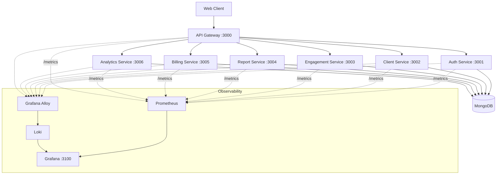
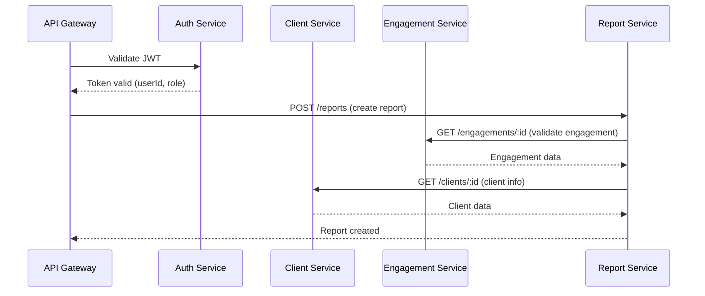
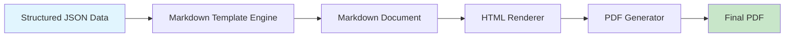
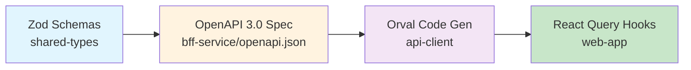
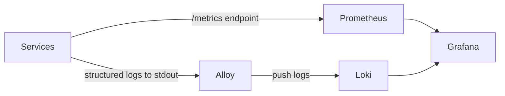

# Architecture Document

## AI Consulting Back-Office Platform

---

## 1. High-Level Architecture



All services communicate over a Docker bridge network via synchronous REST. Each service owns its database collections. The observability stack (Prometheus, Loki, Grafana, Alloy) runs alongside application services.

---

## 2. Microservices Breakdown

### 2.1 API Gateway

**Purpose:** Single entry point for all client requests. Routes to downstream services, enforces authentication via Auth Service.

**Responsibilities:**

- Request routing and proxying
- JWT validation (delegates to Auth Service)
- Rate limiting
- Request/response logging

**Dependencies:** Auth Service (token validation), all downstream services.

---

### 2.2 Auth Service

**Purpose:** User authentication, JWT token issuance and validation, user management.

**Collections:**

- `users` — user accounts (email, passwordHash, role, createdAt, updatedAt)
- `refresh_tokens` — active refresh tokens

**Endpoints:**

| Method | Path           | Description                  |
| ------ | -------------- | ---------------------------- |
| POST   | /auth/register | Register a new user          |
| POST   | /auth/login    | Authenticate and receive JWT |
| POST   | /auth/refresh  | Refresh access token         |
| POST   | /auth/logout   | Invalidate refresh token     |
| GET    | /auth/me       | Get current user profile     |
| PUT    | /auth/me       | Update current user profile  |

**Dependencies:** None (standalone).

---

### 2.3 Client Service

**Purpose:** Manage consulting clients, their contacts, and code credentials.

**Collections:**

- `clients` — company information, technical stack, notes, codeCredentials (encrypted)
- `contacts` — people associated with clients

**Endpoints:**

| Method | Path                             | Description                          |
| ------ | -------------------------------- | ------------------------------------ |
| POST   | /clients                         | Create client                        |
| GET    | /clients                         | List clients                         |
| GET    | /clients/:id                     | Get client details                   |
| PUT    | /clients/:id                     | Update client                        |
| DELETE | /clients/:id                     | Delete client                        |
| POST   | /clients/:id/contacts            | Add contact                          |
| GET    | /clients/:id/contacts            | List contacts                        |
| PUT    | /clients/:id/contacts/:contactId | Update contact                       |
| DELETE | /clients/:id/contacts/:contactId | Delete contact                       |
| PUT    | /clients/:id/credentials         | Update code credentials              |
| GET    | /clients/:id/credentials         | Get code credentials (access-logged) |

**Dependencies:** None.

---

### 2.4 Engagement Service

**Purpose:** Manage consulting engagements and their lifecycle.

**Collections:**

- `engagements` — engagement data including type, accessType, status, priority, timeline, creationDate

**Endpoints:**

| Method | Path                          | Description                   |
| ------ | ----------------------------- | ----------------------------- |
| POST   | /engagements                  | Create engagement             |
| GET    | /engagements                  | List engagements (filterable) |
| GET    | /engagements/:id              | Get engagement details        |
| PUT    | /engagements/:id              | Update engagement             |
| PATCH  | /engagements/:id/status       | Update engagement status      |
| DELETE | /engagements/:id              | Delete engagement             |
| GET    | /engagements/client/:clientId | Get engagements by client     |

**Dependencies:** Client Service (validates clientId).

---

### 2.5 Report Service

**Purpose:** Create, version, and generate consulting reports.

**Collections:**

- `reports` — structured report data (JSON), version history
- `report_templates` — markdown templates for rendering

**Endpoints:**

| Method | Path                           | Description               |
| ------ | ------------------------------ | ------------------------- |
| POST   | /reports                       | Create report             |
| GET    | /reports                       | List reports (filterable) |
| GET    | /reports/:id                   | Get report                |
| PUT    | /reports/:id                   | Update report data        |
| GET    | /reports/:id/versions          | List report versions      |
| GET    | /reports/:id/versions/:version | Get specific version      |
| POST   | /reports/:id/generate/markdown | Generate markdown         |
| POST   | /reports/:id/generate/pdf      | Generate PDF              |

**Dependencies:** Engagement Service (validates engagementId), Client Service (client info for report headers).

---

### 2.6 Billing Service

**Purpose:** Invoice creation, payment tracking, and reminders.

**Collections:**

- `invoices` — invoice data, status, amounts, dates

**Endpoints:**

| Method | Path                               | Description                |
| ------ | ---------------------------------- | -------------------------- |
| POST   | /invoices                          | Create invoice             |
| GET    | /invoices                          | List invoices (filterable) |
| GET    | /invoices/:id                      | Get invoice                |
| PUT    | /invoices/:id                      | Update invoice             |
| PATCH  | /invoices/:id/status               | Update invoice status      |
| POST   | /invoices/:id/send                 | Send invoice               |
| POST   | /invoices/:id/remind               | Send payment reminder      |
| GET    | /invoices/client/:clientId         | Get invoices by client     |
| GET    | /invoices/engagement/:engagementId | Get invoices by engagement |

**Dependencies:** Client Service (client details for invoice), Engagement Service (engagement reference).

---

### 2.7 Analytics Service

**Purpose:** Aggregate business metrics and provide dashboard data.

**Collections:**

- `metrics_snapshots` — periodic snapshots of computed metrics

**Endpoints:**

| Method | Path                 | Description                  |
| ------ | -------------------- | ---------------------------- |
| GET    | /analytics/dashboard | Get dashboard metrics        |
| GET    | /analytics/revenue   | Get revenue breakdown        |
| GET    | /analytics/activity  | Get monthly activity summary |
| GET    | /analytics/clients   | Get client statistics        |

**Dependencies:** All other services (reads data for aggregation).

---

## 3. MongoDB Data Model

### Users (auth-service)

```typescript
const UserSchema = z.object({
  _id: z.string(),
  email: z.string().email(),
  passwordHash: z.string(),
  name: z.string(),
  role: z.enum(['admin', 'consultant']),
  createdAt: z.date(),
  updatedAt: z.date(),
});
```

### Clients (client-service)

```typescript
const ClientSchema = z.object({
  _id: z.string(),
  companyName: z.string(),
  website: z.string().url().optional(),
  industry: z.string().optional(),
  technicalStack: z.array(z.string()),
  notes: z.string().optional(),
  codeCredentials: z
    .object({
      repoUrls: z.array(z.string()).optional(),
      sshKeys: z.array(z.string()).optional(), // encrypted
      tokens: z.array(z.string()).optional(), // encrypted
    })
    .optional(),
  createdAt: z.date(),
  updatedAt: z.date(),
});

const ContactSchema = z.object({
  _id: z.string(),
  clientId: z.string(),
  name: z.string(),
  role: z.string().optional(),
  email: z.string().email(),
  phone: z.string().optional(),
  createdAt: z.date(),
  updatedAt: z.date(),
});
```

### Engagements (engagement-service)

```typescript
const EngagementSchema = z.object({
  _id: z.string(),
  clientId: z.string(),
  type: z.enum(['diagnostic', 'support', 'resolution']),
  accessType: z.enum(['black-box', 'code-delivery', 'code-credentials']),
  description: z.string(),
  priority: z.enum(['low', 'medium', 'high', 'critical']),
  status: z.enum(['requested', 'diagnosis', 'in-progress', 'waiting-for-client', 'completed']),
  assignedConsultant: z.string().optional(),
  timeline: z
    .object({
      startDate: z.date().optional(),
      endDate: z.date().optional(),
      estimatedHours: z.number().optional(),
    })
    .optional(),
  creationDate: z.date(),
  updatedAt: z.date(),
});
```

### Reports (report-service)

```typescript
const ReportSchema = z.object({
  _id: z.string(),
  engagementId: z.string(),
  clientId: z.string(),
  title: z.string(),
  version: z.number(),
  status: z.enum(['draft', 'review', 'final']),
  sections: z.object({
    executiveSummary: z.string(),
    architectureOverview: z.string().optional(),
    problems: z.array(
      z.object({
        title: z.string(),
        severity: z.enum(['low', 'medium', 'high', 'critical']),
        description: z.string(),
        impact: z.string().optional(),
      }),
    ),
    recommendations: z.array(
      z.object({
        title: z.string(),
        priority: z.enum(['low', 'medium', 'high']),
        description: z.string(),
        effort: z.string().optional(),
      }),
    ),
    actionPlan: z.array(
      z.object({
        step: z.number(),
        title: z.string(),
        description: z.string(),
        responsible: z.string().optional(),
        deadline: z.date().optional(),
      }),
    ),
  }),
  createdAt: z.date(),
  updatedAt: z.date(),
});
```

### Invoices (billing-service)

```typescript
const InvoiceSchema = z.object({
  _id: z.string(),
  clientId: z.string(),
  engagementId: z.string(),
  invoiceNumber: z.string(),
  amount: z.number(),
  currency: z.enum(['EUR', 'USD', 'GBP']),
  status: z.enum(['draft', 'issued', 'pending-payment', 'paid', 'overdue']),
  lineItems: z.array(
    z.object({
      description: z.string(),
      quantity: z.number(),
      unitPrice: z.number(),
      total: z.number(),
    }),
  ),
  issueDate: z.date(),
  dueDate: z.date(),
  paidDate: z.date().optional(),
  createdAt: z.date(),
  updatedAt: z.date(),
});
```

---

## 4. API Design

All services expose REST APIs following consistent conventions:

- **Base path:** `/<resource>`
- **Authentication:** Bearer JWT token in Authorization header (validated by API Gateway via Auth Service)
- **Request/Response format:** JSON
- **Error format:** `{ "error": { "code": string, "message": string } }`
- **Pagination:** `?page=1&limit=20` for list endpoints, response includes `{ data: [], total: number, page: number, limit: number }`
- **Filtering:** Query parameters per resource (e.g., `?status=active&type=diagnostic`)

See Section 2 for per-service endpoint tables.

---

## 5. Inter-Service Communication

All inter-service communication is **synchronous REST** over the Docker bridge network. Services address each other by Docker Compose service name (e.g., `http://client-service:3002`).



Internal calls between services use a shared service-to-service token or are restricted to the Docker internal network (no external exposure).

---

## 6. Report Data Structure

### JSON Schema

Reports are stored as structured JSON (see Section 3, ReportSchema). The generation pipeline transforms this data into deliverable documents.

### Generation Pipeline



**Pipeline steps:**

1. **JSON to Markdown:** Report data is injected into markdown templates using a templating engine (e.g., Handlebars/Mustache). Templates define section layout, headers, and formatting.
2. **Markdown to HTML:** The markdown is rendered to HTML with styling (CSS for professional layout, company branding, logos).
3. **HTML to PDF:** The HTML is converted to PDF using a headless browser engine (e.g., Puppeteer) with support for headers, footers, pagination, and company logo.

---

## 7. Shared Types Architecture

All TypeScript interfaces and Zod schemas live in a shared package imported by every service.

```
packages/shared-types/
  src/
    index.ts              # barrel export
    schemas/
      client.ts           # ClientSchema, ContactSchema
      engagement.ts       # EngagementSchema
      report.ts           # ReportSchema
      invoice.ts          # InvoiceSchema
      user.ts             # UserSchema
      common.ts           # PaginationSchema, ErrorSchema, etc.
    openapi/
      init.ts             # extendZodWithOpenApi(z)
      helpers.ts          # createServiceRegistry(), generateOpenAPIDocument()
    types/
      index.ts            # Inferred TypeScript types from Zod schemas
  package.json            # name: @shire/shared-types
  tsconfig.json
```

- Published as `@shire/shared-types` within the pnpm workspace
- Zod schemas serve as single source of truth for both runtime validation and TypeScript types
- Types are inferred from schemas using `z.infer<typeof Schema>`
- All services import from this package — no duplicated type definitions

### Zod → OpenAPI → API Client Pipeline

Zod schemas are the single source of truth that drives the entire API surface — from runtime validation to OpenAPI documentation to generated frontend hooks.



**Step 1 — Zod + OpenAPI metadata:** `@asteasolutions/zod-to-openapi` extends Zod with an `.openapi()` method. Each schema is annotated with its OpenAPI name:

```typescript
export const InvoiceSchema = z
  .object({
    /* ... */
  })
  .openapi('Invoice');
```

**Step 2 — Route registration:** Each service registers its API routes in `*.openapi.ts` files using `registry.registerPath()`, referencing the Zod schemas directly for request/response definitions. These are imported as side-effects at app startup.

**Step 3 — OpenAPI spec generation:** The BFF service aggregates all registered paths into a single OpenAPI 3.0.3 document. `pnpm --filter bff-service dump-openapi` writes `openapi.json`. The spec is also served at runtime via `/openapi.json` and `/swagger` (Swagger UI).

**Step 4 — Client generation:** Orval (`packages/api-client`) reads the BFF's `openapi.json` and generates typed React Query hooks with `pnpm --filter api-client generate`. A custom fetcher handles JWT Bearer token injection and automatic token refresh.

**Step 5 — Frontend consumption:** The web app imports the generated hooks from `@shire/api-client` and wires up token accessors via `setTokenAccessors()` in the auth provider.

**Key packages:**

| Package                          | Role                                                        |
| -------------------------------- | ----------------------------------------------------------- |
| `@shire/shared-types`            | Zod schemas with `.openapi()` annotations, registry helpers |
| `@shire/shared`                  | `mountSwagger()` utility, shared registry with Bearer Auth  |
| `@shire/api-client`              | Orval-generated React Query hooks, custom fetcher           |
| `@asteasolutions/zod-to-openapi` | Bridges Zod schemas to OpenAPI definitions                  |
| `orval`                          | Generates typed API client from OpenAPI spec                |

---

## 8. DevOps / Docker Setup

### Docker Compose Layout

```yaml
# docker-compose.yml structure
services:
  api-gateway: # port 3000
  auth-service: # port 3001
  client-service: # port 3002
  engagement-service: # port 3003
  report-service: # port 3004
  billing-service: # port 3005
  analytics-service: # port 3006
  mongodb: # port 27017
  prometheus: # port 9090
  grafana: # port 3100
  loki: # port 3101
  alloy: # telemetry collector
```

### Networking

- All services on a shared Docker bridge network (`shire-network`)
- Only the API Gateway and Grafana expose ports to the host
- Inter-service communication by service name (Docker DNS)
- MongoDB accessible only from the internal network

### Volumes

- `mongodb-data` — persistent MongoDB storage
- `grafana-data` — Grafana dashboards and configuration
- `prometheus-data` — metrics storage
- `loki-data` — log storage

---

## 9. Repository Structure

```
shire/
  packages/
    shared-types/           # @shire/shared-types — Zod schemas + TS types
      src/
      package.json
      tsconfig.json
  services/
    api-gateway/
      src/
      Dockerfile
      package.json
    auth-service/
      src/
      Dockerfile
      package.json
    client-service/
      src/
      Dockerfile
      package.json
    engagement-service/
      src/
      Dockerfile
      package.json
    report-service/
      src/
      Dockerfile
      package.json
    billing-service/
      src/
      Dockerfile
      package.json
    analytics-service/
      src/
      Dockerfile
      package.json
  infrastructure/
    docker-compose.yml
    docker-compose.dev.yml
    prometheus/
      prometheus.yml
    grafana/
      provisioning/
      dashboards/
    loki/
      loki-config.yml
    alloy/
      config.alloy
  doc/
    PRD.md
    ARCHITECTURE.md
    features/
  .github/
    workflows/
      ci.yml
  package.json               # root workspace config
  pnpm-workspace.yaml
  tsconfig.base.json
  .env.example
  README.md
```

---

## 10. Testing Strategy

### Frameworks

- **Unit / Integration tests:** Vitest (preferred) or Jest
- **HTTP testing:** Supertest
- **Mocking:** Vitest built-in mocks or `jest.mock()`
- **Database testing:** MongoDB Memory Server for integration tests

### Coverage Targets

| Category                | Target                       |
| ----------------------- | ---------------------------- |
| Service logic           | 80%                          |
| API endpoints           | 100%                         |
| Zod schemas             | 100%                         |
| Inter-service contracts | Contract tests for all calls |

### CI Integration

Tests run on every pull request via GitHub Actions:

1. Install dependencies (`pnpm install`)
2. Type-check all packages (`pnpm -r type-check`)
3. Lint all packages (`pnpm -r lint`)
4. Run unit tests (`pnpm -r test:unit`)
5. Run integration tests (`pnpm -r test:integration`)
6. Report coverage

---

## 11. Observability Stack

### Components

| Component     | Role                           | Port |
| ------------- | ------------------------------ | ---- |
| Prometheus    | Metrics collection and storage | 9090 |
| Grafana       | Visualization and dashboards   | 3100 |
| Loki          | Log aggregation                | 3101 |
| Grafana Alloy | Telemetry collection agent     | —    |

### Instrumentation

Every service must:

1. Expose a `/metrics` endpoint in Prometheus format (using `prom-client`)
2. Emit structured JSON logs to stdout (collected by Alloy)
3. Include in every log entry: timestamp, service name, log level, request ID, message, metadata

### Metrics Categories

- **Application:** request rate, request latency (histogram), error rate, service uptime
- **Business:** client count, engagement count, reports generated, invoices issued
- **Infrastructure:** CPU usage, memory usage, container health (collected by Alloy/Prometheus)

### Grafana Dashboards

Pre-provisioned dashboards:

1. **System Health** — service status, uptime, container resource usage
2. **API Performance** — request rates, latency percentiles, error rates per service
3. **Business Metrics** — clients, engagements, revenue, invoice status

### Configuration



---

## 12. MVP Roadmap

### Phase 1: Foundation (~2 weeks)

- Repository setup (monorepo, pnpm workspaces, tsconfig)
- Shared types package with core Zod schemas
- Docker Compose with MongoDB and observability stack
- API Gateway skeleton with JWT validation
- Auth Service (register, login, token management)

### Phase 2: Core Services (~3 weeks)

- Client Service (CRUD, contacts, credentials)
- Engagement Service (CRUD, status management)
- Inter-service communication patterns
- Integration tests for core flows

### Phase 3: Reports & Billing (~3 weeks)

- Report Service (CRUD, versioning)
- Report generation pipeline (JSON → Markdown → HTML → PDF)
- Billing Service (invoices, status tracking)
- PDF template design

### Phase 4: Analytics & Polish (~2 weeks)

- Analytics Service (dashboard metrics, revenue tracking, monthly activity)
- Grafana dashboard provisioning
- End-to-end testing
- Error handling and validation hardening

### Phase 5: CI/CD & Deployment (~2 weeks)

- GitHub Actions CI pipeline
- Docker image builds
- Staging environment setup
- Documentation finalization
- Security review (credential encryption, access logging)
